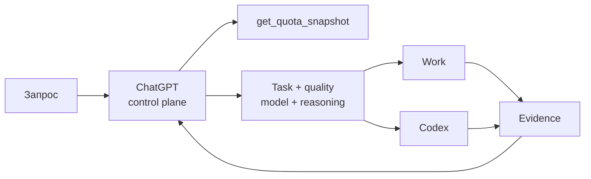

<div align="center">

# OpenAI Work + Codex Regulator

**Skill для ChatGPT, который решает, что оставить в Chat, что отдать Work или Codex, какую модель и reasoning выбрать и как растянуть общую Work/Codex-квоту до reset без просадки по качеству.**

[](https://github.com/misyukdima/openai-work-codex-regulator/releases/latest)
[](https://github.com/misyukdima/openai-work-codex-regulator/actions/workflows/validate.yml)
[](tests/)
[](plugin/README.md)

[Скачать v4.0](https://github.com/misyukdima/openai-work-codex-regulator/releases/latest) · [Быстрый старт](#быстрый-старт) · [Архитектура](docs/ARCHITECTURE.md) · [Безопасность](SECURITY.md) · [Changelog](CHANGELOG.md)

</div>

---

## Что это

В длинном проекте легко сжечь Work/Codex allowance слишком рано. Обратная крайность тоже мешает: можно так беречь лимит, что работа просто встанет.

`openai-work-codex-regulator` держит эту середину. ChatGPT остаётся control plane: понимает задачу, проверяет ограничения, считает runway, выбирает поверхность, модель и reasoning. Work и Codex получают уже готовый self-contained execution packet и возвращают evidence.

Ключевое правило проекта:

```text
QUALITY_FLOOR=NON_NEGOTIABLE
```

Экономить можно на лишнем reasoning, повторном контексте, ненужном research и слишком дорогой модели. Экономить на качестве нельзя.

> **v4.0 не зашивает пятичасовое окно для Plus.** Если текущий quota snapshot содержит weekly window и не содержит secondary window, регулятор работает weekly-only. Отсутствующее окно не превращается в 0%, exhaustion или blocker.

## Быстрый старт

1. Откройте [последний GitHub Release](https://github.com/misyukdima/openai-work-codex-regulator/releases/latest).
2. Скачайте `openai-work-codex-regulator-v4.0.zip`.
3. Установите архив как skill в среде, где вы работаете с ChatGPT.
4. Дальше просто работайте с проектом. Регулятор подключается к задаче как control plane, а Work/Codex получает только то, что нужно для конкретного gate.

Entry point:

```text
openai-work-codex-regulator/SKILL.md
```

Если read-only quota telemetry подключена, ChatGPT использует её автоматически в quota-sensitive точках. Если telemetry недоступна, skill не ломается: ручной first-party snapshot нужен только тогда, когда без него нельзя безопасно решить следующий запуск.

## Как это работает



ChatGPT принимает admission-решение один раз. Downstream executor не перечитывает quota policy, не выбирает модель заново и не получает внутреннюю математику runway.

```text
HANDOFF_SELF_CONTAINED=YES
EXECUTOR_SKILL_REQUIRED=NO
ONE_GATE=ONE_PRIMARY_SURFACE
```

Это экономит allowance там, где он обычно утекает незаметно: на повторное планирование, дублирование контекста и вторую попытку понять уже решённую задачу.

## Что изменилось в v4.0

| Область | Как работает сейчас |
| --- | --- |
| Orchestration | ChatGPT - основной оркестратор, Work/Codex - execution plane |
| Quota | weekly runway считается по оставшимся активным рабочим минутам |
| Рабочее окно | по умолчанию 09:00-22:00, до 23:00 как hard extension; расписание можно менять |
| Secondary limits | учитываются только если реально пришли в текущем account snapshot |
| Model routing | GPT-6 Astra / Sol / Luna + отдельный выбор reasoning effort |
| Quality | более дешёвый вариант допускается только после прохождения quality floor |
| Burn | оценивается по наблюдаемому движению shared allowance, не по API-ценам |
| Ultra / Fast | необязательны; Fast не включается просто ради скорости |
| Validation | 289 regression scenarios + clean ZIP round-trip + security/runtime checks |

## Маршрутизация модели

Это стартовая policy для agentic gate. Текущий picker и доступность в аккаунте всегда важнее статической таблицы.

| Класс задачи | Стартовый профиль | Типичный случай |
| --- | --- | --- |
| Mechanical | **Luna Low** | extraction, dedupe, fixed-schema transforms |
| Routine | **Luna Medium** | понятный brief, bounded app/file work |
| Professional | **Sol Medium** | coding, research, writing, debugging |
| Complex | **Sol High** | сложная реализация, архитектура, глубокая проверка |
| Capability escalation | **Astra Low / Medium** | Sol уже упирается не в depth, а в capability breadth |
| Critical | **Astra High** | security, production, high-error-cost gate |

Одна из важных вещей в v4: capability failure и reasoning-depth failure больше не смешиваются.

```text
reasoning-depth failure -> same model, higher reasoning
capability failure      -> stronger model, often at equal/lower reasoning
```

Поэтому `Sol High` не обязан автоматически превращаться в `Sol xhigh` или `max`. Иногда правильнее сразу перейти на Astra Low/Medium.

## Как распределяется квота

По умолчанию skill считает активным каждый день:

```text
09:00 start
22:00 normal soft end
23:00 hard extension end
```

Ночь и другие off-hours не «съедают» плановый runway. Если weekly reset через три дня, контроллер смотрит не на 72 календарных часа, а на рабочие минуты, которые реально остаются до reset.

Базовая project policy:

```text
BASE_WEEKLY_RESERVE_PP=10
RESERVE_FRACTION_CAP=0.50
RESERVE_RELEASE_ACTIVE_MINUTES=360
BASE_LOOKAHEAD_WORKDAYS=1
MAX_ADVANCE_WORKDAYS=2
```

Эти числа принадлежат проекту, а не OpenAI. Пользовательское расписание можно изменить без переделки skill.

Burn тоже не угадывается по токенам. Контроллер смотрит на совместимые наблюдения по shared meter, использует консервативный bootstrap на первых запусках, а при накопленной истории - median/MAD/P80-подход.

Подробности: [references/10_WEEKLY_QUOTA_CONTROLLER.md](references/10_WEEKLY_QUOTA_CONTROLLER.md) и [references/14_WORK_SCHEDULE_RUNWAY.md](references/14_WORK_SCHEDULE_RUNWAY.md).

## Quota telemetry

Канонический tool:

```text
get_quota_snapshot()
```

Он read-only и не принимает model-provided identity arguments. Subject binding, auth state и credentials остаются на серверной стороне.

Если upstream сообщает secondary window, регулятор учитывает его отдельно. Weekly и secondary percentages не складываются, потому что у них разные знаменатели.

```text
UNKNOWN_IS_NOT_ZERO=YES
FALSE_PRECISION=FORBIDDEN
```

## Безопасность

v4.0 забрала из v3 development line весь security-hardening, который уже прошёл review и CI:

- subject-isolated auth и fail-closed binding;
- sealed credential lifecycle;
- production-safe provider boundaries;
- OIDC/JWKS verification;
- zero-argument read-only quota tool;
- hardened AF_UNIX crypto-helper socket;
- точная проверка owner/type/inode при cleanup;
- отсутствие Python crypto implementation в production path;
- никаких credit purchases, paid resets или permission expansion со стороны regulator.

Подробнее: [SECURITY.md](SECURITY.md) и [plugin/README.md](plugin/README.md).

## Структура репозитория

```text
SKILL.md
skills/openai-work-codex-regulator/SKILL.md
  основной skill + byte-for-byte packaged mirror

references/
  model routing, quota controller, handoff, telemetry, source map

plugin/
  read-only quota backend, auth lifecycle, MCP/OIDC runtime

deployment/
  production/staging adapters и hardened crypto helper

scripts/
  validators, quota controller, release packaging

tests/
  289 regression scenarios + deterministic routing fixtures

docs/
  usage, architecture, deployment и release process
```

Старые research-прототипы в `companion/`, `relay/` и `experiments/` оставлены как история разработки. В release path v4.0 они не нужны.

## Проверка

Основной CI идёт на каждом push и pull request.

Локально release path проверяется так:

```bash
python3 scripts/validate_repo_v4.py
python3 scripts/validate_v4_routing.py
python3 scripts/validate_plugin_package.py
python3 scripts/validate_release_contract.py
python3 scripts/package_release.py
```

Последняя команда собирает ZIP, распаковывает его в чистую временную директорию и повторно прогоняет release validators уже на содержимом архива.

## Релизы

| Версия | Главное | Релиз |
| --- | --- | --- |
| **v4.0** | GPT-6 adaptive routing, active-time weekly runway, current-snapshot quota semantics, v3 security baseline | [Открыть](https://github.com/misyukdima/openai-work-codex-regulator/releases/tag/v4.0) |
| **v2.2** | cumulative quota trajectory, bounded future advance, self-contained handoff | [Открыть](https://github.com/misyukdima/openai-work-codex-regulator/releases/tag/v2.2) |
| **v2.1** | adaptive weekly controller, burn estimation, reserve policy | [Открыть](https://github.com/misyukdima/openai-work-codex-regulator/releases/tag/v2.1) |
| **v2.0** | Astra execution profile and allowance domains | [Открыть](https://github.com/misyukdima/openai-work-codex-regulator/releases/tag/v2.0) |

v3.x осталась development line и отдельно не публиковалась. Полная история - в [CHANGELOG.md](CHANGELOG.md).

## Документация

- [SKILL.md](SKILL.md) - исполняемый контракт.
- [docs/USAGE.md](docs/USAGE.md) - как пользоваться skill.
- [docs/ARCHITECTURE.md](docs/ARCHITECTURE.md) - control plane, execution plane и runtime.
- [docs/IDP_DEPLOYMENT.md](docs/IDP_DEPLOYMENT.md) - IdP / OAuth deployment notes.
- [references/08_MODEL_REASONING_ROUTER.md](references/08_MODEL_REASONING_ROUTER.md) - model + reasoning router.
- [references/14_WORK_SCHEDULE_RUNWAY.md](references/14_WORK_SCHEDULE_RUNWAY.md) - active-time runway.
- [references/SOURCE_MAP.md](references/SOURCE_MAP.md) - first-party sources и граница между фактами продукта и project policy.
- [SECURITY.md](SECURITY.md) - security model.
- [CONTRIBUTING.md](CONTRIBUTING.md) - правила изменений.

---

<div align="center">

**v4.0 · 289 regression scenarios · release archive + SHA-256**

[Latest release](https://github.com/misyukdima/openai-work-codex-regulator/releases/latest)

</div>
